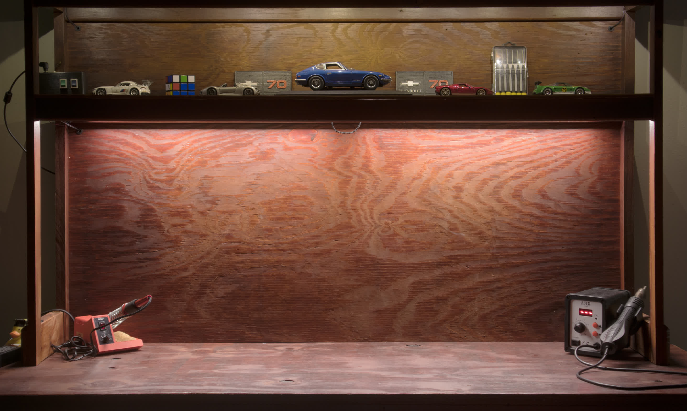
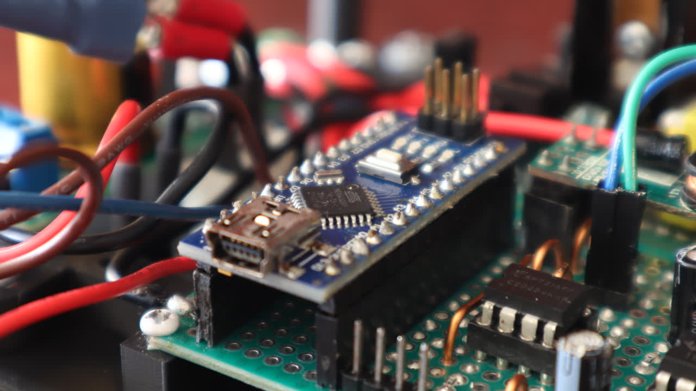
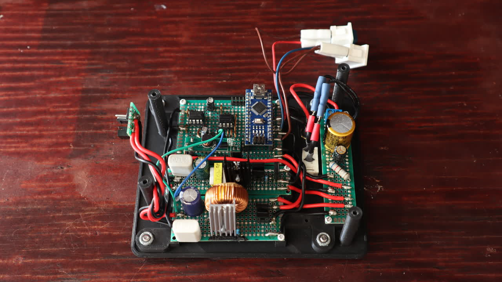
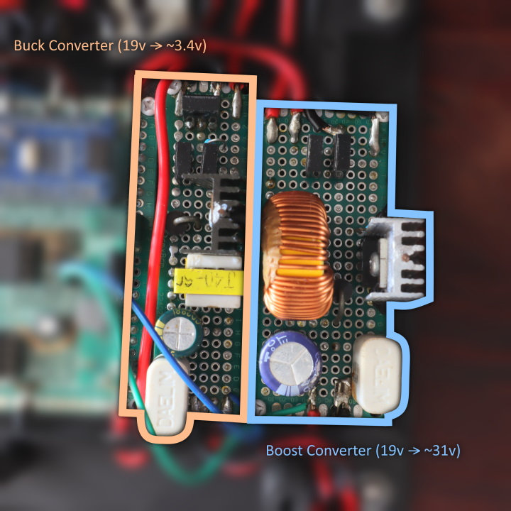

# Workbench Lighting System

This repository contains fireware code for my workbench lighting system. It is designed to convert 19v DC into two voltage channels, the Main LED which needs ~31v, and the Auxilarary LED which outputs around ~3.4v. The brightness (voltage) of each channel can be adjusted via thier respective potentiometers, and they also be disabled by flicking thier respective switches aswell.

## The Microcontroller

The lighting circuitry depends on the Arduino Nano development board which uses the ATmega328P microcontroller. Thanks to the Arduino development kit, programming the microcontroller is easy because it contains easy to use functions to control the I/O pins.

Its main job is to produce a PWM signal to the two voltage output channels to control the brightness of the lights, and furthermore, it has protections against overvoltage and high PWM duty cycles to the circuits.

## Lighting Circuits

What circuits are used to control the voltage output? The simplest way to control voltage is to directly send the PWM to the lights, but there are two problems to this. First of all, PWM actuated lights are flickery and are uneasy on the eye. Secondly, the input voltage for the entire system is 19v (supplied by a 60w laptop charger). Thus 19v isn't enough for the main LEDs which have ~31v forward voltage for decent brightness, and 19v is way too much for the auxilary LEDs which require ~3.4v voltage.

To resolve this problem, the circuitry is using one boost converter (for increasing voltage) and one buck converter (for reducing voltage). These converters control the main and auxilary LEDs respectively. These are perfect for the lights because they output a steady voltage (so no flickering), and they can control thier output voltage via adjusting the duty cycle.

